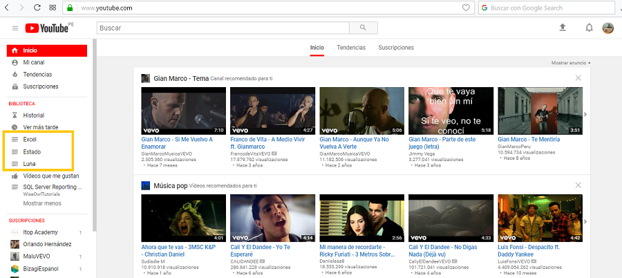
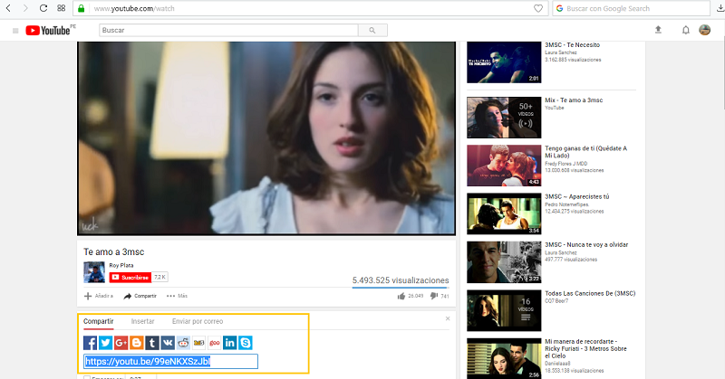
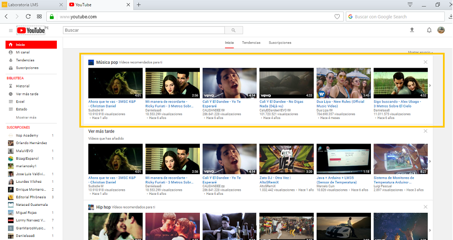
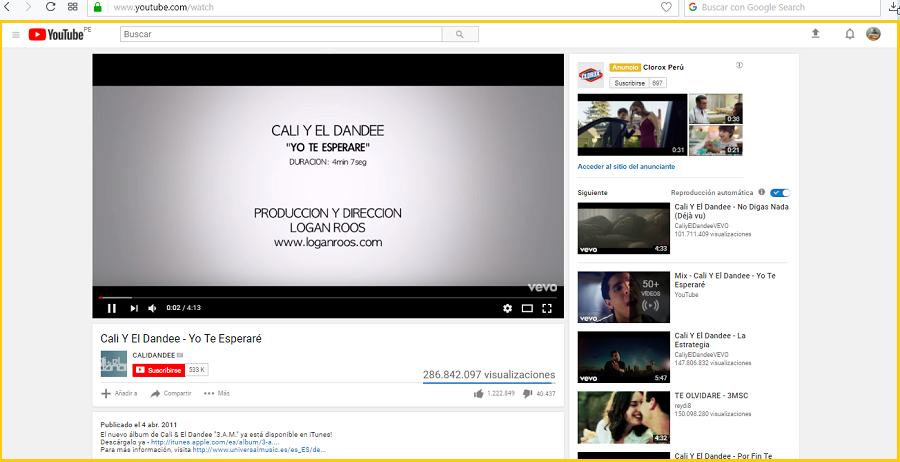

## Reto UX/UI-Youtube

Explicar qué partes conforman el UX y qué partes el UI

1. **UX**
 1.1.- Que pueda crear mi propia biblioteca de música.
 .
 1.2.- Que se pueda compartir un video de manera fácil y sencilla por las redes sociales.
 .
 1.3.- Que me muestre canales recomendados según mi historial.
 .
 1.4.- La forma en cómo está organizado los videos y la información de las mismas.
 .
 1.5.- Que me permita añadir facilmente los videos que quiero ver "mas tarde".
 .

2. **UI**
1.1.- La tipografía y el tamaño de letra.

1.2.- Los colores de las letras(negro y rojo).

1.3.-El color de los botones(rojo).

1.4.- El diseño de los menú.

1.5.-El diseño de los botones.

1.6.- El color y diseño de los íconos.
